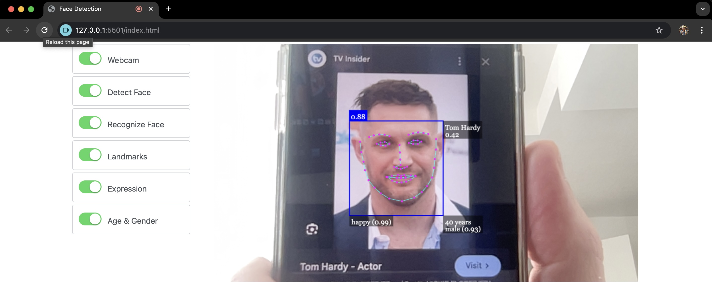

# Face detection and recognition from a webcam in a web browser

This app detects and recognizes individuals listed under `.\labeled_images` from a webcam in a web browser using [face-api.js](https://github.com/justadudewhohacks/face-api.js) JavaScript library.

## How to run it locally

1. Clone the repo.
1. Open it in _Visual Studio Code_ with _Live Server_ extension installed.
1. Right click `index.html` and then click _Open with Live Service_.

## How to add more individuals that can be recognized

1. Copy a new person image to `.\labeled_images` directory. Make sure the image has `.jpg` extension.
1. Add the image name (without extension) to `labels` array in `.\js\face-detection.js`.
1. Refresh `index.html` page in a web browser.

## Click to Watch Demo

